### Folder Structure

Each `nPractice` directory contains the complete solution for that specific assignment, organized as follows:

* **`assets/`**: Contains screenshots demonstrating the successfully completed task.
* **`completed_practice/`**  *(if applicable)*: Contains all the source code and files implemented for this practice.
* **`run.sh`** *(if applicable)*: For tasks that require execution, this bash script acts as an orchestrator. You can run this script to automatically set up the environment and execute all necessary tasks for the practice.


## Practice 01

```bash
chmod +x 01Practice/run.sh
./01Practice/run.sh
```

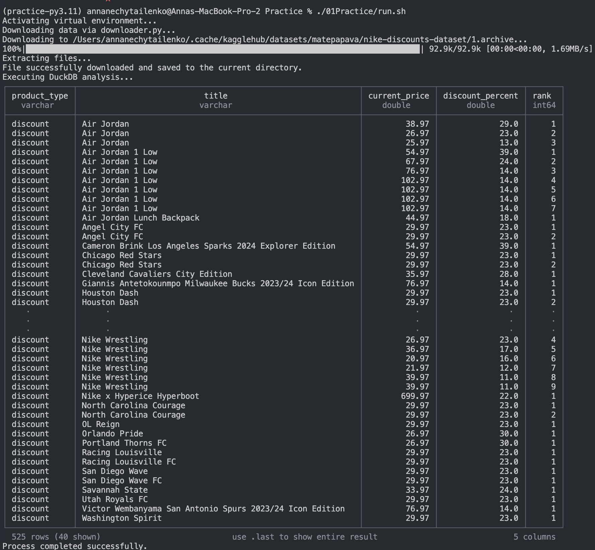


## Practice 02

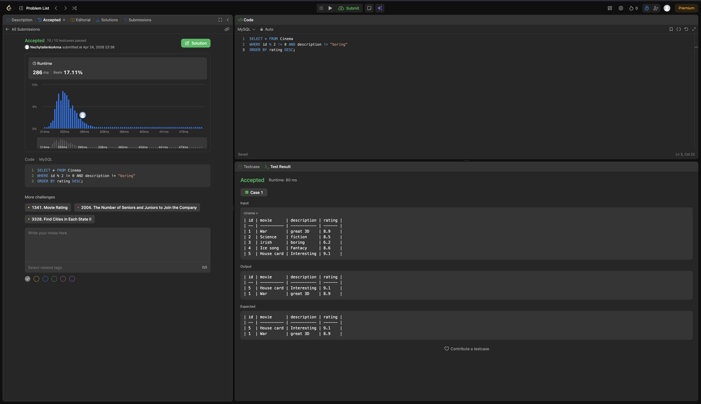
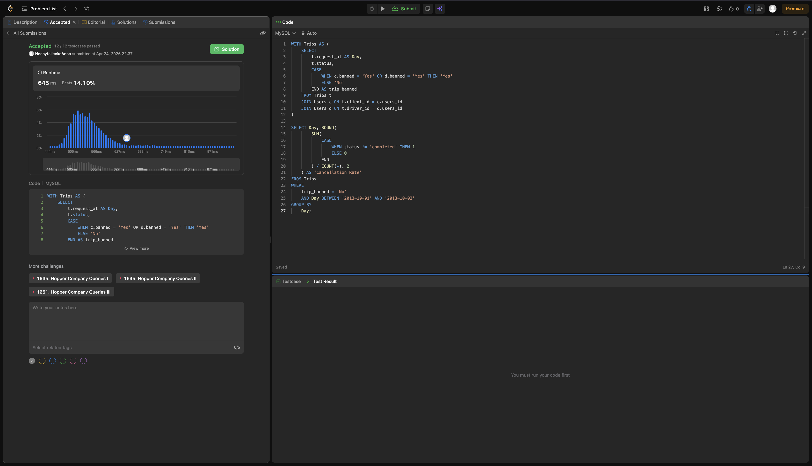


./03Practice/run.sh


## Practice 03

```bash
chmod +x 03Practice/run.sh
./03Practice/run.sh
```

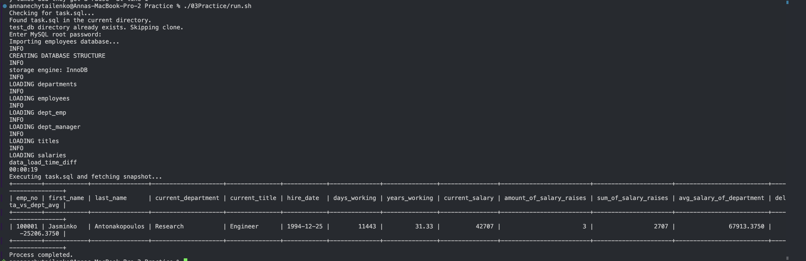


## Practice 04

```bash
chmod +x ./04Practice/run.sh
./04Practice/run.sh
```

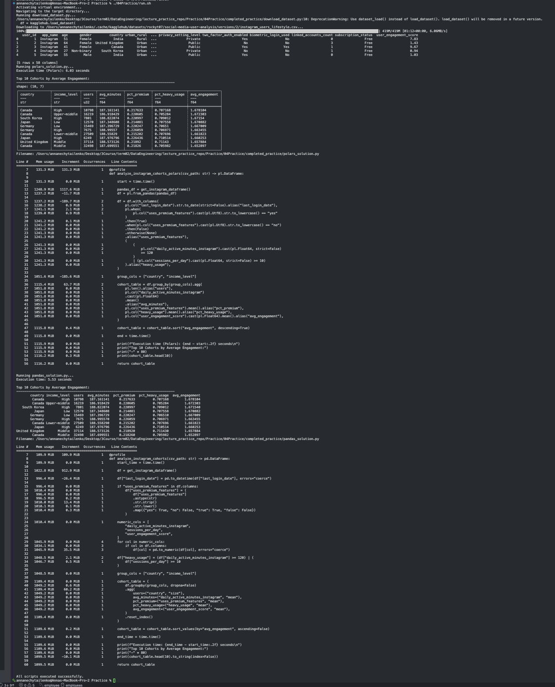


## Practice 05

```bash
chmod +x 05Practice/run.sh
./05Practice/run.sh
```

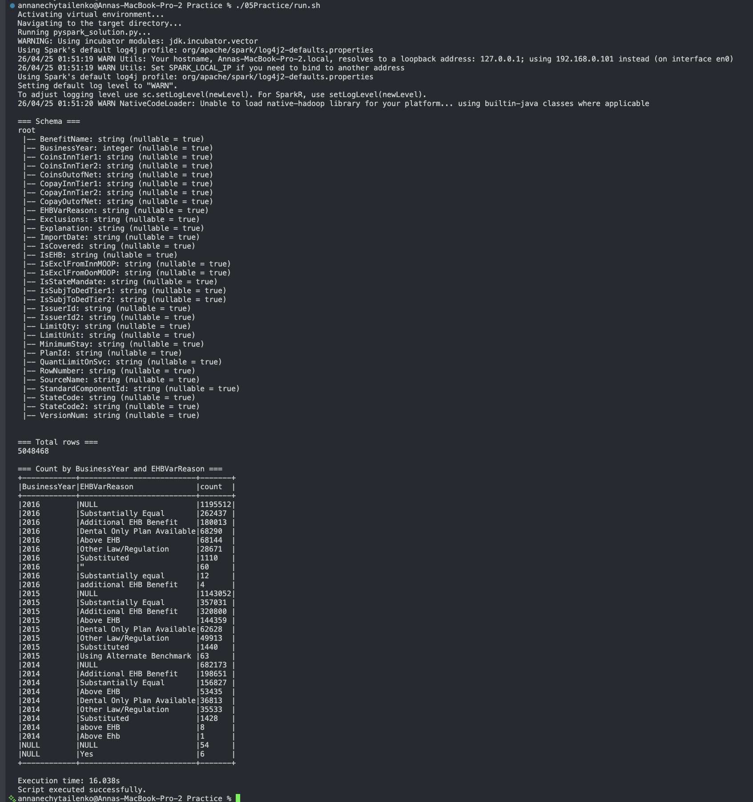


## Practice 06

```bash
chmod +x 06Practice/run.sh
./06Practice/run.sh
```

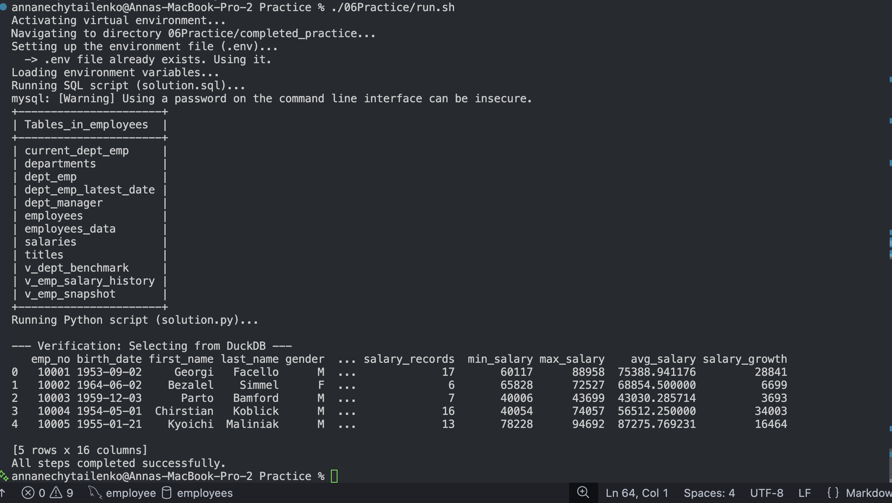


## Practice 07

```bash
chmod +x 07Practice/run.sh
./07Practice/run.sh
```

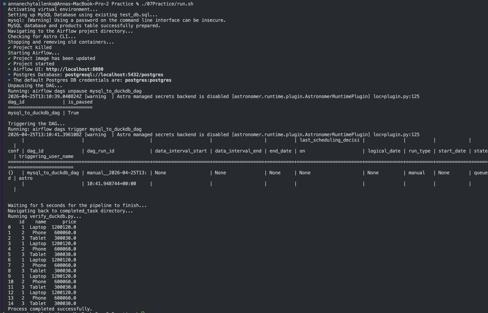


## Practice 08

```bash
chmod +x 08Practice/run.sh
./08Practice/run.sh
```
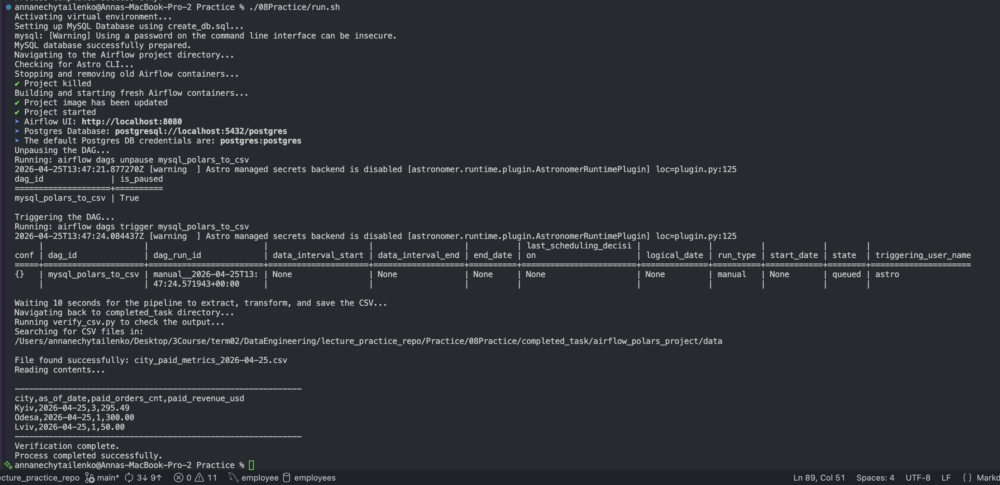


## Practice 09

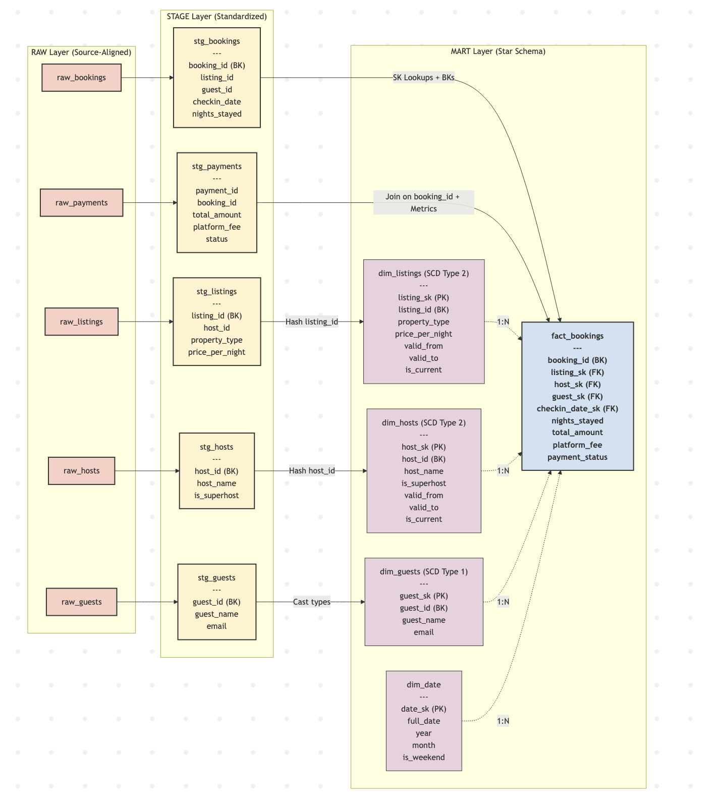


## Practice 11_12

```bash
chmod +x 11_12Practice/run.sh
./11_12Practice/run.sh
```

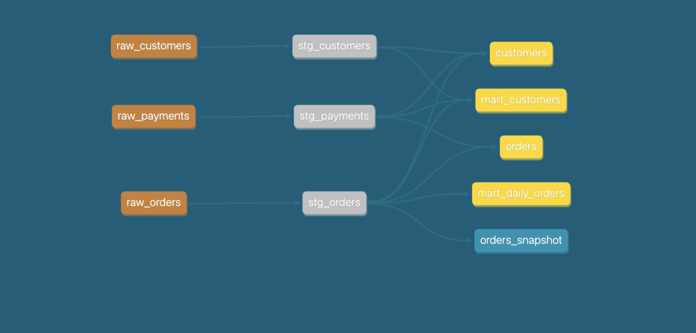
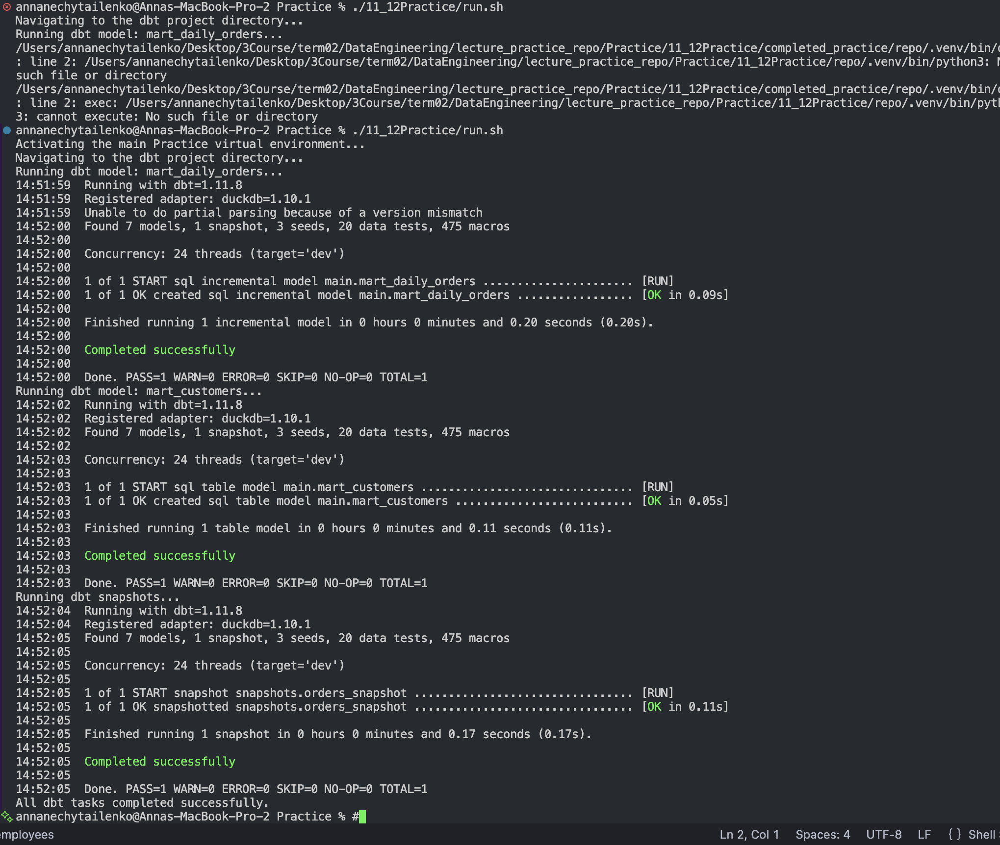`


##  Practice 13
```bash
chmod +x 13Practice/run.sh
./13Practice/run.sh
```

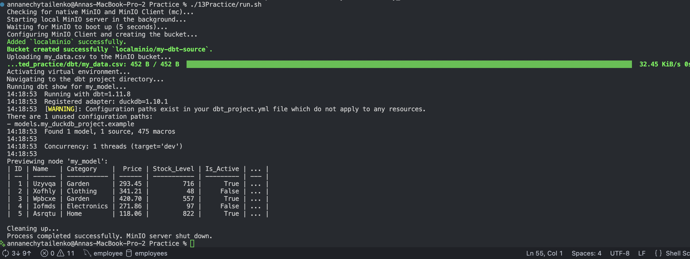

## Practice 14


## Practice 15


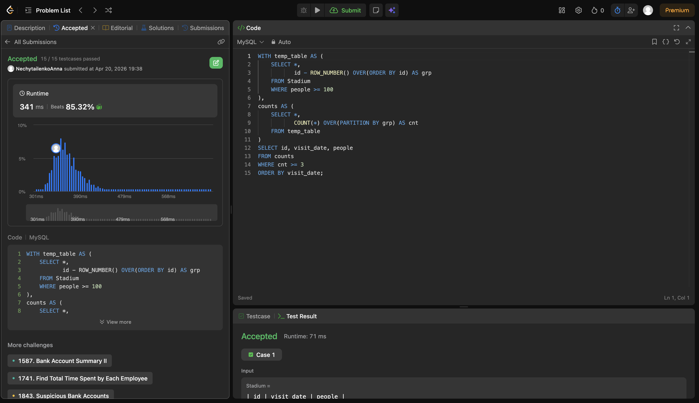

